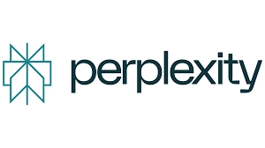

# Perplexity推出4250万美元分成计划，Comet浏览器正面挑战Google

---

如果你是内容平台或订阅业务的负责人，可能已经注意到：AI搜索不再只是流量分发的问题，它正在变成一种新的变现模式。Perplexity AI刚刚推出的Comet Plus订阅计划，直接向出版商分享订阅收入——这不是象征性的补偿，而是一个4250万美元的真金白银池子。问题是：这套玩法能跑通吗？对传统内容订阅业务来说，这是机会还是陷阱？

---

## Perplexity是什么？为什么值得关注

[Perplexity AI](https://pplx.ai/ixkwood69619635)是一家2022年成立于旧金山的AI搜索公司。和Google返回一堆链接不同，它直接给你答案，还附上来源引用。这种"答案引擎"模式让它迅速积累了数亿次月查询量，吸引了贝索斯、英伟达和软银的投资。

2025年7月，Perplexity推出了自己的AI浏览器**Comet**。这个基于Chromium的浏览器把AI助手直接嵌入浏览体验：你可以高亮文本提问，让AI跨标签页整合信息，甚至让它帮你完成购物、预订等任务。简单说，Comet想把浏览器本身变成AI代理——这是对Google长期统治的正面挑战。

目前Comet还在邀请制阶段，普通用户需要加入等待名单。但如果你订阅了**Perplexity Pro**，可以立即获得访问权限。

## 4250万美元怎么分？Comet Plus的分成逻辑

2025年8月，Perplexity推出了**Comet Plus订阅计划**，月费5美元。这不是普通的会员服务——它背后是一个**4250万美元的收入分成池**，专门用来补偿内容出版商。

分成规则很直接：**出版商拿80%，Perplexity留20%**。钱从哪来？三个场景：

- **直接流量**：用户从Comet浏览器点击进入出版商网站
- **引用**：出版商内容出现在AI生成的答案中
- **代理使用**：Comet的AI助手依赖出版商内容完成任务

已经加入的出版商包括Blavity、Der Spiegel、Fortune、Gannett、The Independent和Time。Perplexity的出版商合作负责人Jessica Chan在接受Digiday采访时透露，支票已经开始发放，部分合作伙伴可能拿到"数百万美元"。她的原话是："Perplexity只有在新闻业成功时才能成功。"

## 法律压力和安全漏洞：光鲜背后的隐忧

这套分成模式听起来很美好，但Perplexity眼下的麻烦不少。

全球多家出版商——包括新闻集团、日经新闻、朝日新闻和BBC——正在起诉它未经授权使用新闻内容训练AI和生成答案。这不是小打小闹，而是关乎AI行业根基的法律博弈。

与此同时，Comet浏览器最近还被曝出一个严重安全漏洞：隐藏的提示词可以操纵AI助手的行为。虽然漏洞已经修复，但这暴露了AI浏览器在技术成熟度上的短板。

## 对订阅业务意味着什么？机会与风险并存

如果你负责内容订阅或会员业务，[Perplexity的Comet Plus计划](https://pplx.ai/ixkwood69619635)值得认真研究——但不要急着下注。

**机会在哪？**

这是第一次有AI平台明确承诺：当你的内容被引用、访问或用于AI任务时，你能拿到真金白银。相比传统广告分成，这套模式更透明，也更直接。如果规模化，它可能成为内容驱动型订阅业务的新收入来源。

**风险在哪？**

AI生成的答案会剥离上下文、品牌调性和订阅关系。即使你拿到了分成，也不代表那些通过AI接触内容的用户会转化为付费订阅者。更何况，法律纠纷和技术漏洞还没尘埃落定，这套模式能不能跑通还是未知数。

**更大的战略意义**

Perplexity不是在用钱堵嘴。通过推出Comet并绑定分成模式，它在**直接挑战Google在搜索和分发领域的垄断地位**。对订阅业务负责人来说，关键信号是：**可见性、变现方式和竞争格局都在被AI优先的平台重新定义**。

观察Comet Plus的演变，能帮你判断是否要参与这类模式，以及如何参与。

## 常见问题

**Comet浏览器现在能用吗？**  
目前还在邀请制阶段。你可以加入等待名单，或者订阅Perplexity Pro立即获得访问权限。

**Comet Plus的5美元月费值得吗？**  
如果你经常使用AI搜索和浏览器内的AI助手，这个价格不算贵。但对普通用户来说，免费版Perplexity可能已经够用。

**出版商真的能拿到"数百万美元"吗？**  
理论上可以，但取决于内容被引用和访问的频率。头部媒体可能受益明显，长尾内容创作者的收益还不确定。

**Perplexity和Google有什么本质区别？**  
Google给你一堆链接让你自己找答案，[Perplexity直接给你答案并标注来源](https://pplx.ai/ixkwood69619635)。Comet浏览器更进一步，把AI助手嵌入整个浏览流程。

**法律纠纷会影响Comet Plus吗？**  
有可能。如果法院判定Perplexity侵权，整个分成模式的合法性都会受到质疑。这也是为什么现在参与还需要谨慎观望。

---

## 结语

Perplexity的Comet Plus计划不是简单的公关动作，而是一次对AI时代内容分发和变现逻辑的重构尝试。4250万美元的分成池、80%的出版商分成比例、以及直接挑战Google的野心，都让这个模式值得关注。但法律风险、技术漏洞和转化率的不确定性也提醒我们：这条路还很长。对订阅业务来说，[Perplexity适合作为观察AI搜索演变的窗口](https://pplx.ai/ixkwood69619635)，而不是立刻押注的赛道。保持关注，等待更多数据，再做决策。
